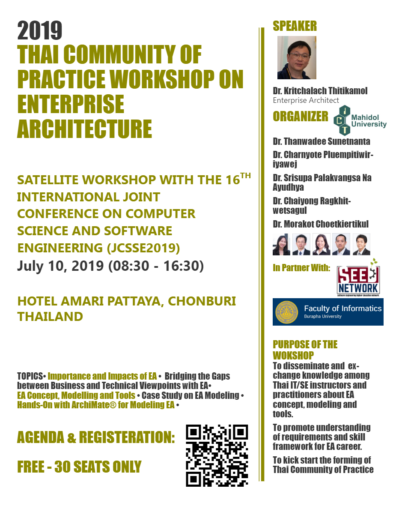

## Satellite Workshop with the 16th International Joint Conference on Computer Science and Software Engineering (JCSSE2019)
### July 10, 2019 (08:30 - 16:30), Hotel Amari Pattaya, Chonburi, Thailand

#### Speaker			
Dr. Kritchalach Thitikamol, Enterprise Architect

#### Organizers: Faculty of ICT, Mahidol University
1.	Dr. Thanwadee Sunetnanta	
2.	Dr. Charnyote Pluempitiwiriyawej	
3.	Dr. Srisupa Palakavangsa Na Ayudha
4.	Dr. Chaiyong Ragkhitwetsagul	
5.	Dr. Morakot Choetkiertikul		

#### Purpose of the Workshop
1.	To disseminate and exchange knowledge among IT/SE instructors from universities and IT/SE practitioners from software industry in Thailand about enterprise architecture concept, modelling and tools.
2.	To promote understanding of requirements and skill framework for enterprise architect career.
3.	To kick start the forming of Thai Community of Practice on Enterprise Architecture to interested parties.

#### Workshop Topics
1.	Importance and impact of architecture in software engineering
2.	Enterprise architecture concept, modelling and tools 
3.	Bridging the gaps between business and technical viewpoints on enterprise architecture concept
4.	Case study on enterprise architecture modeling
5.	Hand-on ArchiMate® for modeling enterprise architecture

#### Format of the Workshop
In the morning session, the workshop will start with knowledge sharing talk by invited enterprise architect and specialist from software industry, then follow by presentation on enterprise architecture concept and other outlined topics. The afternoon session will be modeling workshop to put enterprise architecture concept into practice with case studies and hands-on tutorial to introduce the use of ArchiMate®.

ArchiMate® is a registered trademark of The Open Group.

